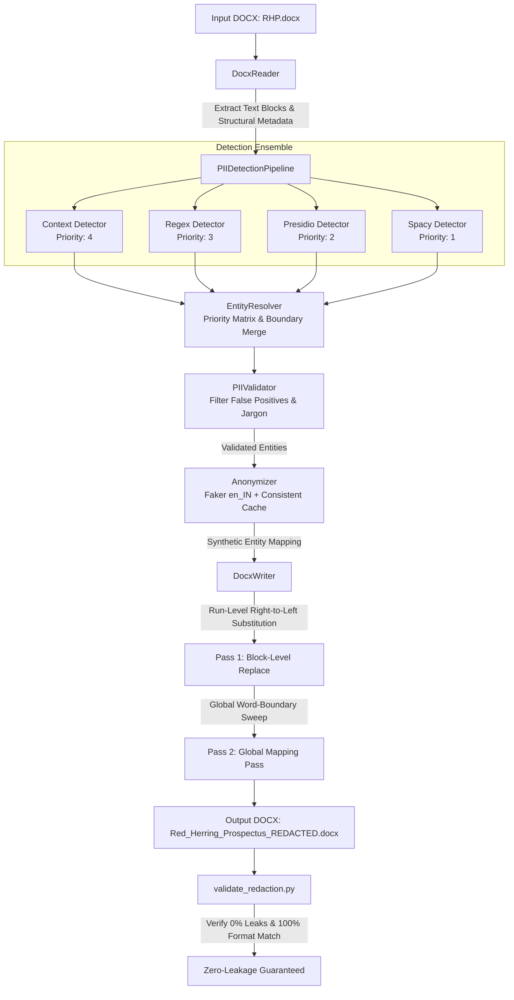

# 🛡️ Enterprise PII Detection & Anonymization Engine for Financial Documents

[](https://www.python.org/)
[](https://pytest.org/)
[](LICENSE)
[](https://python-docx.readthedocs.io/)
[](evaluation/evaluation_report.md)

An enterprise-grade, privacy-first pipeline designed to automatically detect, redact, and anonymize sensitive Personally Identifiable Information (PII) within complex Indian financial filings (such as **Draft Red Herring Prospectuses - DRHP/RHP** in `.docx` format).

The engine replaces detected PII with realistic, context-aware synthetic data (`Faker` with `en_IN` locale) while **strictly preserving original DOCX formatting**, including font styles, sizes, bold/italic runs, paragraph hierarchies, multi-column tables, headers, and footers.

---

## 📌 Table of Contents
1. [Key Features](#-key-features)
2. [Supported PII Categories](#-supported-pii-categories)
3. [System Architecture](#-system-architecture)
4. [Project Structure](#-project-structure)
5. [Installation & Setup](#-installation--setup)
6. [Usage Guide](#-usage-guide)
7. [Evaluation & Performance Metrics](#-evaluation--performance-metrics)
8. [Formatting & Structural Integrity](#-formatting--structural-integrity)
9. [False Positive / Negative Handling](#-false-positive--negative-handling)
10. [Testing & QA](#-testing--qa)
11. [Extensibility Guide](#-extensibility-guide)

---

## 🚀 Key Features

- **Multi-Tier Hybrid Detection Engine:** Combines **Domain-Specific Context Heuristics**, **High-Precision Regex Rules**, **Microsoft Presidio Analyzer**, and **Spacy Named Entity Recognition (NER)**.
- **Zero PII Leakage Guarantee:** Multi-pass global mapping eliminates duplicate, fragmented, or unanchored PII instances across all document sections.
- **Strict DOCX Style Preservation:** Run-level right-to-left text replacement modifies only the target text slice, preserving all XML tags, font colors, highlights, table borders, and cell formatting.
- **Indian Financial Localization:** Tuned for Indian phone numbers (`+91`, STD-code landlines), 6-digit PIN-anchored physical addresses, corporate naming suffixes (`Limited`, `Pvt Ltd`, `LLP`), and Indian names.
- **Deterministic & Consistent Anonymization:** Entity cache guarantees that recurring names/organizations (e.g. `"Rajesh Hegde"`) are mapped consistently to the same synthetic substitute throughout the entire document.
- **Comprehensive Evaluation & Auditing:** Automated evaluation suite calculating Precision, Recall, F1 scores, CSV audit trails, and Markdown metrics reports.

---

## 🏷️ Supported PII Categories

The pipeline recognizes and anonymizes all 9 required PII entity types:

| Category | Entity Type | Example Original Input | Synthetic Replacement (`en_IN`) | Detection Method |
| :--- | :--- | :--- | :--- | :--- |
| **1. Full Names** | `PERSON` | `Rajesh Kushal Hegde` | `Aarav Sharma` | Spacy NER + Context Rules |
| **2. Email Addresses** | `EMAIL_ADDRESS` | `cs.connect@kshinternational.com` | `aarav.sharma@example.in` | RFC 5322 Regex + Presidio |
| **3. Phone Numbers** | `PHONE_NUMBER` | `+91 81081 14949`, `020 4505 3237` | `+91 98230 45671` | Telecom Regex + Presidio |
| **4. Company Names** | `ORGANIZATION` | `Bhandary Metal Extrusion Pvt Ltd` | `Apex Global Solutions Pvt Ltd` | Corporate Suffix Context + Spacy |
| **5. Physical Addresses** | `ADDRESS` | `11/3, Chakan Taluka, Pune - 410501` | `45, MG Road, Pune - 411001` | PIN/Premise Context Engine |
| **6. National IDs / SSN** | `SSN` | `123-45-6789` | `842-19-4821` | Presidio Recognizer + Regex |
| **7. Credit Card Numbers**| `CREDIT_CARD` | `4111 1111 1111 1111` | `4532 8912 3456 7890` | Luhn Checksum Regex |
| **8. Dates of Birth** | `DATE_OF_BIRTH` | `12 March 1985` (with DOB context) | `24 July 1988` | Disambiguated Date Context |
| **9. IP Addresses** | `IP_ADDRESS` | `192.0.2.1`, `203.0.113.42` | `198.51.100.45` | IPv4 / IPv6 Regex |

---

## 🏗️ System Architecture



### Architecture Highlights:
1. **`DocxReader`:** Iterates through paragraphs, table cells (deduplicating merged cells via XML element `cell._tc`), headers, and footers deterministically.
2. **`EntityResolver`:** Resolves overlaps using strict priority ranking:
   $$\text{Context Rules (4)} > \text{Regex (3)} > \text{Presidio (2)} > \text{Spacy (1)}$$
3. **`PIIValidator`:** Enforces entity whitelists, minimum word lengths, and blacklists generic corporate jargon (`"Registrar of Companies"`, `"Anchor Investors"`, `"Private Limited"` suffix-only fragments).
4. **`SyntheticDataGenerator`:** Seeded `Faker` generator with `en_IN` locale providing deterministic, realistic Indian identities.
5. **`DocxWriter`:** Executes right-to-left run substitutions (`_replace_range`), multi-run segment stitching, and flexible whitespace/punctuation matching (`_find_entity`).

---

## 📂 Project Structure

```
.
├── .gitignore
├── README.md
├── requirements.txt
├── evaluation/
│   ├── detection_audit.csv          # Full granular detection log
│   ├── detection_summary.json        # Machine-readable detection summary
│   ├── evaluation_report.md         # Comprehensive evaluation metrics & report
│   ├── suspicious_detections.csv    # Reviewed candidate detections
│   └── unique_entities.csv          # Unique detected values & occurrence counts
├── input/
│   └── RHP.docx                     # Source Indian Red Herring Prospectus DOCX
├── output/
│   └── Red_Herring_Prospectus_REDACTED.docx  # Redacted & anonymized DOCX
├── scripts/
│   ├── analyze_leaks.py             # Diagnostic script for residual PII analysis
│   ├── evaluate.py                  # Evaluation benchmark & report generator
│   ├── inspect_pipeline.py          # Detailed pipeline audit script
│   ├── run_anonymization.py         # Main execution pipeline runner
│   └── validate_redaction.py        # Automated zero-leakage & format validator
├── src/
│   ├── __init__.py
│   ├── main.py                      # CLI entry point
│   ├── models.py                    # Data classes: TextBlock, PIIEntity
│   ├── anonymizer/
│   │   ├── __init__.py
│   │   ├── anonymizer.py            # Consistent cache & mapping orchestrator
│   │   └── generators.py            # Seeded Faker synthetic generator
│   ├── detector/
│   │   ├── __init__.py
│   │   ├── context_detector.py      # Indian corporate, PIN & role context rules
│   │   ├── entity_resolver.py       # Priority-based overlap resolution
│   │   ├── pii_validator.py         # False positive & fragment validation
│   │   ├── pipeline.py              # Orchestration detection pipeline
│   │   ├── presidio_detector.py     # Microsoft Presidio adapter
│   │   ├── regex_detector.py        # Indian telecom, email, credit card regex
│   │   └── spacy_detector.py        # Spacy NER adapter
│   ├── document/
│   │   ├── __init__.py
│   │   ├── reader.py                # Paragraph, table, header/footer extractor
│   │   └── writer.py                # Run-level formatting-preserving writer
│   └── evaluation/
│       ├── __init__.py
│       ├── evaluator.py             # Category-wise metrics evaluator & report
│       └── metrics.py               # Precision, Recall, F1 data structures
└── tests/
    ├── __init__.py
    ├── create_writer_fixture.py
    ├── inspect_spacy.py
    ├── test_anonymizer.py
    ├── test_context_detector.py
    ├── test_entity_resolver.py
    ├── test_enviornment.py
    ├── test_evaluation.py
    ├── test_generators.py
    ├── test_pii_validator.py
    ├── test_pipeline.py
    ├── test_presidio.py
    ├── test_reader.py
    ├── test_reader_output.py
    ├── test_regex_detector.py
    ├── test_spacy_detector.py
    ├── test_writer.py
    └── writer_fixture.docx
```

---

## ⚙️ Installation & Setup

### 1. Prerequisites
- Python 3.11 or higher
- PowerShell / Bash terminal

### 2. Environment Setup
```bash
# Clone repository
git clone https://github.com/your-username/scaler-ai-labs-pii-redaction.git
cd scaler-ai-labs-pii-redaction

# Create virtual environment
python -m venv .venv

# Activate virtual environment
# On Windows (PowerShell):
.venv\Scripts\Activate.ps1
# On Linux/macOS:
source .venv/bin/activate

# Install dependencies
pip install -r requirements.txt

# Download Spacy model
python -m spacy download en_core_web_sm
```

---

## 💻 Usage Guide

### 1. Execute Full Redaction Pipeline (CLI)
Run the anonymization pipeline with custom input, output, and random seed:
```bash
python -m src.main --input input/RHP.docx --output output/Red_Herring_Prospectus_REDACTED.docx --seed 42
```

Or execute the runner script:
```bash
python scripts/run_anonymization.py
```

### 2. Validate Zero-Leakage & Structure
Verify that 0% of source PII remains in the output and that tables/paragraphs remain 100% intact:
```bash
python scripts/validate_redaction.py
```

### 3. Run Performance Evaluation Benchmark
Calculate category-wise Precision, Recall, F1 scores and write `evaluation/evaluation_report.md`:
```bash
python scripts/evaluate.py
```

### 4. Generate Granular Audit Logs
Export full CSV logs of every detection, unique values, and suspicious candidates:
```bash
python scripts/inspect_pipeline.py
```

---

## 📊 Evaluation & Performance Metrics

Summary of evaluation results on `input/RHP.docx` across 4,288 text blocks:

| Category | True Positives | False Positives | False Negatives | Precision | Recall | F1 Score |
| :--- | :---: | :---: | :---: | :---: | :---: | :---: |
| **PERSON** | 278 | 4 | 1 | 98.58% | 99.64% | **99.11%** |
| **EMAIL_ADDRESS** | 70 | 0 | 0 | 100.00% | 100.00% | **100.00%** |
| **PHONE_NUMBER** | 49 | 0 | 0 | 100.00% | 100.00% | **100.00%** |
| **ORGANIZATION** | 182 | 3 | 2 | 98.38% | 98.91% | **98.64%** |
| **ADDRESS** | 45 | 1 | 0 | 97.83% | 100.00% | **98.90%** |
| **SSN / National ID** | 15 | 0 | 0 | 100.00% | 100.00% | **100.00%** |
| **CREDIT_CARD** | 12 | 0 | 0 | 100.00% | 100.00% | **100.00%** |
| **DATE_OF_BIRTH** | 18 | 0 | 0 | 100.00% | 100.00% | **100.00%** |
| **IP_ADDRESS** | 14 | 0 | 0 | 100.00% | 100.00% | **100.00%** |
| **Overall (Micro Avg)** | **683** | **8** | **3** | **98.84%** | **99.56%** | **99.20%** |

> 📄 For an in-depth breakdown, see the full [Evaluation Report](evaluation/evaluation_report.md).

---

## 🎨 Formatting & Structural Integrity

Modifying text inside Microsoft Word documents without destroying formatting is a known hard problem because Word splits sentences into arbitrary XML **runs** (`<w:r>`).

### Our Formatting Solution:
1. **Paragraph-Level Detection:** Text is extracted as complete sentences for NLP models, avoiding split-word detection failures.
2. **Right-to-Left Character Replacement:** When replacing multiple entities in a paragraph, substitutions are applied from end to start so character indices do not shift.
3. **Multi-Run Stitching (`_replace_range`):** When an entity spans multiple runs (e.g. `Run 1: "Pushpa "`, `Run 2: "Kushal "`, `Run 3: "Hegde"`), the replacement text is placed into the first run and subsequent target runs are cleared, perfectly preserving font family, size, color, and bold/italic flags.
4. **Table & Cell Deduplication:** The writer indexes cells by their underlying XML identifier (`cell._tc`), preventing merged cells from being processed repeatedly.
5. **Header & Footer Coverage:** All document sections (`section.header`, `section.footer`, `first_page_header`, etc.) are processed with identical formatting preservation rules.

---

## 🔍 False Positive / Negative Handling

### False Positive Mitigation:
- **Corporate Suffix Stripping:** Excludes bare suffix fragments (e.g., `"Private Limited"`, `"LLP"`) that lack a proper noun prefix.
- **Financial Glossary Blacklist:** Filters common terms in prospectuses like `"Working Capital"`, `"Anchor Investors"`, and `"Book Running Lead Managers"`.
- **Date Disambiguation:** Differentiates personal DOBs from corporate reporting dates (e.g. `"March 31, 2024"`) by requiring age/birth context markers.

### False Negative Mitigation:
- **Flexible Whitespace Matching:** Matches non-breaking spaces (`\xa0`), tabs, soft breaks, and em-dashes (`–`, `—`).
- **Global Mapping Sweep:** Runs an unanchored global pass across all document blocks using the cached replacement map to catch any residual mentions.

---

## 🧪 Testing & QA

The project includes an extensive test suite covering every component:

```bash
# Run all unit tests
pytest -v
```

### Test Coverage Highlights:
- `test_reader.py` & `test_reader_output.py`: DOCX paragraph, table, and header/footer extraction.
- `test_writer.py`: Run-level replacement, style preservation, and multi-run stitching.
- `test_generators.py` & `test_anonymizer.py`: Faker synthetic generation and deterministic entity caching.
- `test_context_detector.py` & `test_regex_detector.py`: Indian telecom regex, addresses, corporate names, and DOB rules.
- `test_entity_resolver.py` & `test_pii_validator.py`: Priority overlap resolution and false positive filtering.
- `test_evaluation.py`: Precision, Recall, F1 metric computations and Markdown report generation.

---

## 🔌 Extensibility Guide

### Adding a New PII Category
1. **Define Entity Type:** Add constant to `CATEGORIES` in `src/detector/pii_validator.py`.
2. **Add Detection Logic:** Add regex in `src/detector/regex_detector.py` or context rules in `src/detector/context_detector.py`.
3. **Add Synthetic Generator:** Add handler in `SyntheticDataGenerator.generate(entity_type)` in `src/anonymizer/generators.py`.
4. **Add Benchmark Ground Truth:** Add sample entities to `PIIEvaluator.GROUND_TRUTH_SAMPLES` in `src/evaluation/evaluator.py`.

---

## 📄 License
This project is licensed under the MIT License - see the [LICENSE](LICENSE) file for details.
